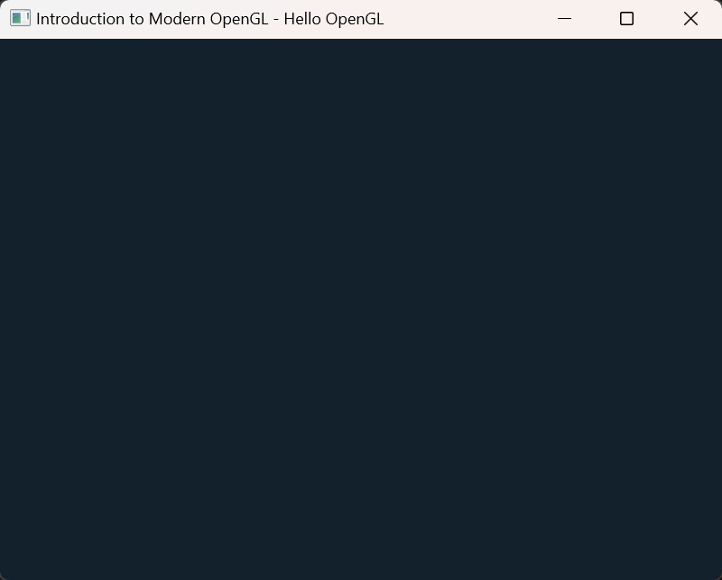

<!-- TOC start (generated with https://github.com/derlin/bitdowntoc) -->
- [Modern OpenGL Tutorial](#modern-opengl-tutorial)
  * [Install vcpkg](#install-vcpkg)
  * [01 Hello OpenGL](#01-hello-opengl)
  * [02 Hello Triangle](#02-hello-triangle)
  * [03 Hello Shader](#03-hello-shader)
  * [04 Hello Texture](#04-hello-texture)
  * [05 Hello Camera](#05-hello-camera)
  * [06 Hello Skybox](#06-hello-skybox)
  * [07 Hello Object](#07-hello-object)
  * [08 Hello Lighting](#08-hello-lighting)
  * [09 Hello Shadow](#09-hello-shadow)
  * [10 Hello ImGUI](#10-hello-imgui)


# Modern OpenGL Tutorial

> vcpkg is a free and open-source C/C++ package manager maintained by Microsoft and the C++ community.

The source code is based on [Learn OpenGL](https://learnopengl.com/Getting-started/OpenGL) and the [Udemy course](https://www.udemy.com/course/learn-modern-opengl-programming/), with improvements on memory safety and:

- Cross Platform (Windows / Linux) Support
- Automatic library management via vcpkg
- Add ImGUI to interact with OpenGL


## Install vcpkg

```
$ sudo apt install build-essential pkg-config cmake curl zip unzip tar
$ sudo apt install libxinerama-dev libxcursor-dev xorg-dev libglu1-mesa-dev

$ git clone https://github.com/microsoft/vcpkg.git
$ cd vcpkg
$ ./bootstrap-vcpkg.sh
$ echo 'export VCPKG_ROOT=$HOME/vcpkg' >> ~/.bashrc
$ echo 'export PATH=$PATH:$VCPKG_ROOT' >> ~/.bashrc
$ source ~/.bashrc
$ vcpkg integrate install
```


## Create new projects

```
$ vcpkg new --application
$ vcpkg add port fmt glfw3 glad
$ vcpkg x-update-baseline --add-initial-baseline
```

C++ dependencies are defined in `vcpkg.json`:

```
{
  "dependencies": [
    "fmt",
    "glfw3",
    "glad"
  ]
}
```


## 01 Hello OpenGL

The first example creates a window using `glfw` and  `glad`.

```
$ cd hello-opengl
$ cmake -B build --preset vcpkg
$ cmake --build build
$ ./build/hello-opengl
```



```
glfwInit();

glfwWindowHint(GLFW_CONTEXT_VERSION_MAJOR, 3);
glfwWindowHint(GLFW_CONTEXT_VERSION_MINOR, 3);
glfwWindowHint(GLFW_OPENGL_PROFILE, GLFW_OPENGL_CORE_PROFILE);

GLFWwindow* window = glfwCreateWindow(800, 800, "Hello", NULL, NULL);

if (window == NULL) {
    fmt::print("Failed to create a window\n");
    glfwTerminate();
    return -1;
}
glfwMakeContextCurrent(window);

glfwSetKeyCallback(window, glfw_onKey);

gladLoadGL();
```


## 02 Hello Triangle

This example creates a triangle and displays the FPS.

```
$ cd hello-triangle
$ cmake -B build --preset vcpkg
$ cmake --build build
$ ./build/hello-triangle
```


You'll learn how to compile and link vertex shader and fragment shader.

```
// Compile and link the vertex shader
GLuint vertexShader = glCreateShader(GL_VERTEX_SHADER);
glShaderSource(vertexShader, 1, &vertexShaderSource, NULL);
glCompileShader(vertexShader);

// Compile and link the fragment shader
GLuint fragmentShader = glCreateShader(GL_FRAGMENT_SHADER);
glShaderSource(fragmentShader, 1, &fragmentShaderSource, NULL);
glCompileShader(fragmentShader);

// Link the vertex and fragment shader into a shader program
GLuint shaderProgram = glCreateProgram();

glAttachShader(shaderProgram, vertexShader);
glAttachShader(shaderProgram, fragmentShader);
glLinkProgram(shaderProgram);

glDeleteShader(vertexShader);
glDeleteShader(fragmentShader);
```

And bind the data to VAO, VBO.

```
// Create VBO and VAO
GLuint VAO, VBO;

glGenVertexArrays(1, &VAO);
glGenBuffers(1, &VBO);

glBindVertexArray(VAO);
glBindBuffer(GL_ARRAY_BUFFER, VBO);

glBufferData(GL_ARRAY_BUFFER, sizeof(vertices), vertices, GL_STATIC_DRAW);
glVertexAttribPointer(0, 3, GL_FLOAT, GL_FALSE, 3 * sizeof(float), (void*)0);
glEnableVertexAttribArray(0);

// Unbind the VBO and VAO
glBindBuffer(GL_ARRAY_BUFFER, 0);
glBindVertexArray(0);
```


## 03 Hello Shader

This example applies animations to the triangle by changing the position offset in vertex shader:

```
$ cd hello-shader
$ cmake -B build --preset vcpkg
$ cmake --build build
$ ./build/hello-shader
```


```
// Animate the quad
GLfloat time = (GLfloat)glfwGetTime();

// Update the positon of the quad
glm::vec2 pos;
pos.x = sin(time) / 2;
pos.y = cos(time) / 2;

// Update the color of the quad
GLfloat blueColor = (sin(time) / 2) + 0.5f;

shaderProgram.setUniform("vertColor", glm::vec4(0.0f, 0.0f, blueColor, 1.0f));
shaderProgram.setUniform("posOffset", pos);
```

Vertex Shader:

```
#version 330 core

layout (location = 0) in vec3 pos;

uniform vec2 posOffset;

void main()
{
	gl_Position = vec4(pos.x + posOffset.x, pos.y + posOffset.y, pos.z, 1.0);
}
```


## 04 Hello Texture

This example loads a texture using `stbi` image library. 

```
$ cd hello-texture
$ cmake -B build --preset vcpkg
$ cmake --build build
$ ./build/hello-texture
```


```
// Use stbi image library to load our image
int width, height, components;
stbi_set_flip_vertically_on_load(true);
unsigned char* imageData = stbi_load(fileName.c_str(), &width, &height, &components, STBI_rgb_alpha);

if (imageData == NULL)
{
    fmt::println("Error loading texture '{}'", fileName);
    return false;
}

glGenTextures(1, &mTexture);
glBindTexture(GL_TEXTURE_2D, mTexture); // all upcoming GL_TEXTURE_2D operations will affect our texture object (mTexture)

glTexParameteri(GL_TEXTURE_2D, GL_TEXTURE_WRAP_S, GL_REPEAT);
glTexParameteri(GL_TEXTURE_2D, GL_TEXTURE_WRAP_T, GL_REPEAT);
glTexParameteri(GL_TEXTURE_2D, GL_TEXTURE_MIN_FILTER, GL_LINEAR);
glTexParameteri(GL_TEXTURE_2D, GL_TEXTURE_MAG_FILTER, GL_LINEAR);

glTexImage2D(GL_TEXTURE_2D, 0, GL_RGBA, width, height, 0, GL_RGBA, GL_UNSIGNED_BYTE, imageData);

if (generateMipMaps)
    glGenerateMipmap(GL_TEXTURE_2D);

stbi_image_free(imageData);

glBindTexture(GL_TEXTURE_2D, 0); // unbind texture when done so we don't accidentally mess up our mTexture
```

Fragment Shader

```
#version 330 core

in vec2 TexCoord;
out vec4 frag_color;

uniform sampler2D texSampler1;
uniform sampler2D texSampler2;

void main()
{
	frag_color = mix(texture(texSampler1, TexCoord), texture(texSampler2, TexCoord), 0.2);
}
```


## 05 Hello Camera

This example adds a camera to the scene (Key: WASD / QE).

```
$ cd hello-camera
$ cmake -B build --preset vcpkg
$ cmake --build build
$ ./build/hello-camera
```


We first enable the depth buffer to enable a 3D world.

```
glEnable(GL_DEPTH_TEST);
glClear(GL_COLOR_BUFFER_BIT | GL_DEPTH_BUFFER_BIT);
```

Then we can change the view in vertex shader.

```
#version 330 core

layout (location = 0) in vec3 pos;  // in local coords
layout (location = 1) in vec2 texCoord;

out vec2 TexCoord;

uniform mat4 model;			// model matrix
uniform mat4 view;			// view matrix
uniform mat4 projection;	// projection matrix

void main()
{
	gl_Position = projection * view * model * vec4(pos, 1.0f);
	TexCoord = texCoord;
}
```


## 06 Hello Skybox

This example adds a skybox to the scene.

```
$ cd hello-skybox
$ cmake -B build --preset vcpkg
$ cmake --build build
$ ./build/hello-skybox
```


Draw the skybox

```
// skybox cube
glDepthFunc(GL_LEQUAL);  // change depth function so depth test passes
skyboxShader.use();
skyboxShader.setUniform("view", glm::mat4(glm::mat3(view)));
skyboxShader.setUniform("projection", projection);

glBindVertexArray(skyboxVAO);

glActiveTexture(GL_TEXTURE0);
glBindTexture(GL_TEXTURE_CUBE_MAP, cubemapTexture);

// Draw the skybox
glDrawArrays(GL_TRIANGLES, 0, 36);

glBindVertexArray(0);
glDepthFunc(GL_LESS); // set depth function back to default
```

The vertex shader:

```
#version 330 core
layout (location = 0) in vec3 pos;

uniform mat4 view;
uniform mat4 projection;

out vec3 TexCoords;

void main()
{
	TexCoords = pos;
	vec4 pos = projection * view * vec4(pos, 1.0f);
	gl_Position = pos.xyww;
}
```


## 07 Hello Object

This example use the library [TinyOBJLoader](https://github.com/tinyobjloader/tinyobjloader) to load 3D models.

```
$ cd hello-object
$ cmake -B build --preset vcpkg
$ cmake --build build
$ ./build/hello-object
```


We load the OBJ model using `tinyobj::ObjReader`:

```
//-----------------------------------------------------------------------------
// Loads a Wavefront OBJ model
//-----------------------------------------------------------------------------
bool Mesh::loadOBJ(const std::string& filename)
{
	std::vector<unsigned int> vertexIndices, uvIndices;

    tinyobj::ObjReader reader;
	tinyobj::ObjReaderConfig reader_config;
	reader_config.mtl_search_path = "./models"; // Path to material files

	if (!reader.ParseFromFile(filename, reader_config)) {
		if (!reader.Error().empty()) {
			fmt::println("TinyObjReader: {}", reader.Error());
		}
		return false;
	}

	if (!reader.Warning().empty()) {
		fmt::println("TinyObjReader: {}", reader.Warning());
	}

	auto& attrib = reader.GetAttrib();
	auto& shapes = reader.GetShapes();
	auto& materials = reader.GetMaterials();

	// Loop over shapes
	for (size_t s = 0; s < shapes.size(); s++) {
		// Loop over faces (polygon)
		size_t index_offset = 0;
		for (size_t f = 0; f < shapes[s].mesh.num_face_vertices.size(); f++) {
			size_t fv = size_t(shapes[s].mesh.num_face_vertices[f]);

			// Loop over vertices in the face.
			for (size_t v = 0; v < fv; v++) {
				Vertex meshVertex;

				// access to vertex
				tinyobj::index_t idx = shapes[s].mesh.indices[index_offset + v];
				tinyobj::real_t vx = attrib.vertices[3 * size_t(idx.vertex_index) + 0];
				tinyobj::real_t vy = attrib.vertices[3 * size_t(idx.vertex_index) + 1];
				tinyobj::real_t vz = attrib.vertices[3 * size_t(idx.vertex_index) + 2];

				glm::vec3 vertex(vx, vy, vz);

				// Check if normal data exists
				if (idx.normal_index >= 0) {
					tinyobj::real_t nx = attrib.normals[3 * size_t(idx.normal_index) + 0];
					tinyobj::real_t ny = attrib.normals[3 * size_t(idx.normal_index) + 1];
					tinyobj::real_t nz = attrib.normals[3 * size_t(idx.normal_index) + 2];
				}

				glm::vec2 uv;
				// Check if texcoord data exists
				if (idx.texcoord_index >= 0) {
					tinyobj::real_t tx = attrib.texcoords[2 * size_t(idx.texcoord_index) + 0];
					tinyobj::real_t ty = attrib.texcoords[2 * size_t(idx.texcoord_index) + 1];
					uv.s = tx;
					uv.t = ty;
				}
				
				// Save the OBJ data
				meshVertex.position = vertex;
				meshVertex.texCoords = uv;
				mVertices.push_back(meshVertex);
			}
			index_offset += fv;
		}
	}

	// Create and initialize the buffers
	initBuffers();

	return (mLoaded = true);
}
```

And then render each object in the scene:

```
// Render the scene
for (int i = 0; i < numModels; i++)
{
    model = glm::translate(glm::mat4(1.0), modelPos[i]) * glm::scale(glm::mat4(1.0), modelScale[i]);
    shaderProgram.setUniform("model", model);

    texture[i].bind(0);		// set the texture before drawing.
    mesh[i].draw();			// Render the OBJ mesh
    texture[i].unbind(0);
}
```


## 08 Hello Lighting

This example adds a point light to the scene.

```
$ cd hello-lighting
$ cmake -B build --preset vcpkg
$ cmake --build build
$ ./build/hello-lighting
```


To add lighting, we also load the normal from OBJ files.

```
// Check if normal data exists
if (idx.normal_index >= 0) {
    tinyobj::real_t nx = attrib.normals[3 * size_t(idx.normal_index) + 0];
    tinyobj::real_t ny = attrib.normals[3 * size_t(idx.normal_index) + 1];
    tinyobj::real_t nz = attrib.normals[3 * size_t(idx.normal_index) + 2];

    glm::vec3 normal(nx, ny, nz);
    meshVertex.normal = normal;
}
```

Then we pass the normal to the vertex shader and fragment shader.

```
#version 330 core

layout (location = 0) in vec3 pos;			
layout (location = 1) in vec3 normal;	
layout (location = 2) in vec2 texCoord;

uniform mat4 model;			// model matrix
uniform mat4 view;			// view matrix
uniform mat4 projection;	// projection matrix

out vec3 FragPos;
out vec3 Normal;
out vec2 TexCoord;

void main()
{
    FragPos = vec3(model * vec4(pos, 1.0f));			// vertex position in world space
	Normal = normal;
	
	TexCoord = texCoord;

	gl_Position = projection * view *  model * vec4(pos, 1.0f);
}
```

The blinn phong fracment shader:

```
#version 330 core

in vec2 TexCoord;
in vec3 FragPos;
in vec3 Normal;

uniform sampler2D texture_map;
uniform vec3 lightPos;			// for diffuse
uniform vec3 lightColor;		// for diffuse
uniform vec3 viewPos;			// for specular

out vec4 frag_color;

void main()
{
    // Ambient ---------------------------------------------------------
    float ambientFactor = 0.1f;
    vec3 ambient = lightColor * ambientFactor;

    // Diffuse ------------------------------------
    vec3 normal = normalize(Normal);
    vec3 lightDir = normalize(lightPos - FragPos);
    float NDotL = max(dot(normal, lightDir), 0.0);
    vec3 diffuse = lightColor * NDotL;

    // Specular (Blinn-Phong)-------------------------------------------
	float specularFactor = 0.8f;
	float shininess = 32.0f;
	vec3 viewDir = normalize(viewPos - FragPos);
	vec3 halfDir = normalize(lightDir + viewDir);
	float NDotH = max(dot(normal, halfDir), 0.0);
	vec3 specular = lightColor * specularFactor * pow(NDotH, shininess);

	vec4 texel = texture(texture_map, TexCoord);
    frag_color = vec4(ambient + diffuse + specular, 1.0f) * texel;
}
```


## 09 Hello Shadow


```
$ cd hello-shadow
$ cmake -B build --preset vcpkg
$ cmake --build build
$ ./build/hello-shadow
```


## 10 Hello ImGUI


```
$ cd hello-imgui
$ cmake -B build --preset vcpkg
$ cmake --build build
$ ./build/hello-imgui
```


## Resources

- https://www.udemy.com/course/learn-modern-opengl-programming/
- https://learnopengl.com/Getting-started/OpenGL
